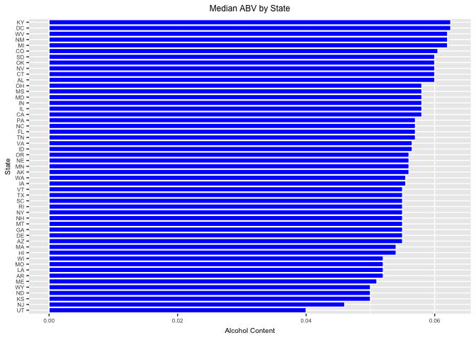
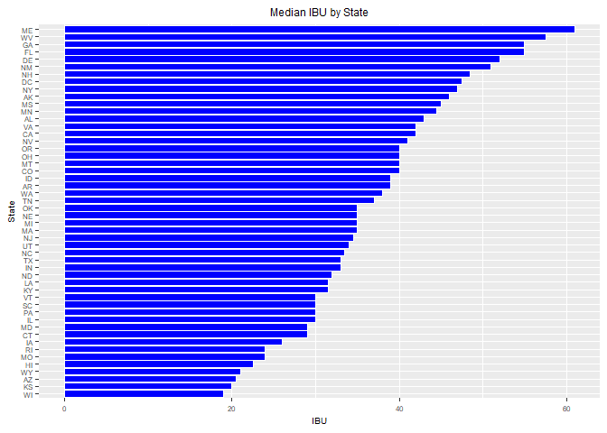
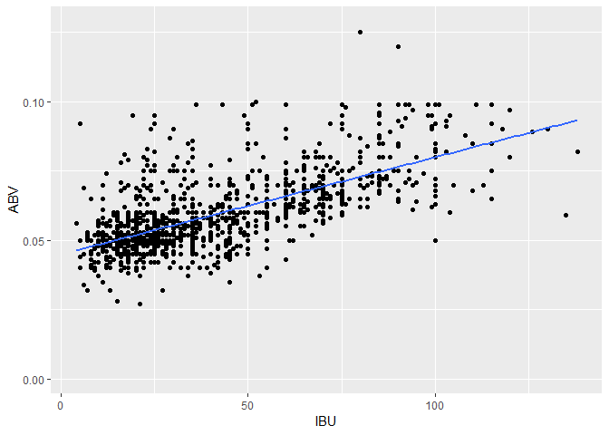

## Introduction

*With a strong presence across the 50 states and the District of Columbia, craft breweries are a vibrant and flourishing economic force at the local, state and national level. As consumers continue to demand a wide range of high quality, full-flavored beers, small and independent craft brewers are meeting this growing demand with innovative offerings, creating high levels of economic value in the process.*

**Bart Watson**, Chief Economist for the Brewers Association

https://www.brewersassociation.org/statistics/economic-impact-data/

We have been hired to gain incite into breweries in the United Stated. We will focus on providing information to a national brewery for them to look into investing in the craft brewery industry.

## Data

The data for this study will consist of two databases collected and supplied by our client.

**Data/Beers.csv**

| Variable | Description |
| -------- | ----------- |
| Name | name of beer |
| BeerID | unique id number of the beer |
| ABV | alcohol by volume of beer |
| IBU | international bitterness units of the beer |
| Style | style of beer |
| Ounces | unit of measurement for the beer by oz |

**Data/Breweries.csv**

| Variable | Description |
| -------- | ----------- |
| Name | name of beer |
| Brew_ID | unique identification number of the brewery |
| Name | name of brewery |
| City | city where brewery is located |
| State | state where brewery is located |

## Folder Information

This will be information about folders

## Questions our client would like addresses

Load libraries

```
## 
## Attaching package: 'dplyr'
```

```
## The following objects are masked from 'package:stats':
## 
##     filter, lag
```

```
## The following objects are masked from 'package:base':
## 
##     intersect, setdiff, setequal, union
```

```
## -------------------------------------------------------------------------
```

```
## You have loaded plyr after dplyr - this is likely to cause problems.
## If you need functions from both plyr and dplyr, please load plyr first, then dplyr:
## library(plyr); library(dplyr)
```

```
## -------------------------------------------------------------------------
```

```
## 
## Attaching package: 'plyr'
```

```
## The following objects are masked from 'package:dplyr':
## 
##     arrange, count, desc, failwith, id, mutate, rename, summarise,
##     summarize
```


Read the two databases into R

```r
#read in the two databases
breweries <- read.csv("Data/Breweries.csv")
beers <- read.csv("Data/Beers.csv")
```


   1. How many breweries are present in each state?

```r
#count breweries in each state
brew_state <- table(breweries$State)
brew_state
```

```
## 
##  AK  AL  AR  AZ  CA  CO  CT  DC  DE  FL  GA  HI  IA  ID  IL  IN  KS  KY 
##   7   3   2  11  39  47   8   1   2  15   7   4   5   5  18  22   3   4 
##  LA  MA  MD  ME  MI  MN  MO  MS  MT  NC  ND  NE  NH  NJ  NM  NV  NY  OH 
##   5  23   7   9  32  12   9   2   9  19   1   5   3   3   4   2  16  15 
##  OK  OR  PA  RI  SC  SD  TN  TX  UT  VA  VT  WA  WI  WV  WY 
##   6  29  25   5   4   1   3  28   4  16  10  23  20   1   4
```

   2. Merge beer data with the breweries data. Print the first 6 observations and the last six observations to check the merged file.

```r
#looking at each database to see problems before the merge
head(beers)
```

```
##                  Name Beer_ID   ABV IBU Brewery_id
## 1            Pub Beer    1436 0.050  NA        409
## 2         Devil's Cup    2265 0.066  NA        178
## 3 Rise of the Phoenix    2264 0.071  NA        178
## 4            Sinister    2263 0.090  NA        178
## 5       Sex and Candy    2262 0.075  NA        178
## 6        Black Exodus    2261 0.077  NA        178
##                            Style Ounces
## 1            American Pale Lager     12
## 2        American Pale Ale (APA)     12
## 3                   American IPA     12
## 4 American Double / Imperial IPA     12
## 5                   American IPA     12
## 6                  Oatmeal Stout     12
```

```r
head(breweries)
```

```
##   Brew_ID                      Name          City State
## 1       1        NorthGate Brewing    Minneapolis    MN
## 2       2 Against the Grain Brewery    Louisville    KY
## 3       3  Jack's Abby Craft Lagers    Framingham    MA
## 4       4 Mike Hess Brewing Company     San Diego    CA
## 5       5   Fort Point Beer Company San Francisco    CA
## 6       6     COAST Brewing Company    Charleston    SC
```

```r
#rename Brew_ID to Brewery_id to merge data
colnames(breweries)[1] <- "Brewery_id"
#both have a "Name" two for different groups
#rename Name to Brewery_Name
colnames(breweries)[2] <- "Brewery_Name"
#rename Name to Beer_Name
colnames(beers)[1] <- "Beer_Name"
#merge both data sets
brew_beer <- merge.data.frame(beers, breweries, by = "Brewery_id")
#print the first 6 observations
head(brew_beer, 6)
```

```
##   Brewery_id     Beer_Name Beer_ID   ABV IBU
## 1          1  Get Together    2692 0.045  50
## 2          1 Maggie's Leap    2691 0.049  26
## 3          1    Wall's End    2690 0.048  19
## 4          1       Pumpion    2689 0.060  38
## 5          1    Stronghold    2688 0.060  25
## 6          1   Parapet ESB    2687 0.056  47
##                                 Style Ounces       Brewery_Name
## 1                        American IPA     16 NorthGate Brewing 
## 2                  Milk / Sweet Stout     16 NorthGate Brewing 
## 3                   English Brown Ale     16 NorthGate Brewing 
## 4                         Pumpkin Ale     16 NorthGate Brewing 
## 5                     American Porter     16 NorthGate Brewing 
## 6 Extra Special / Strong Bitter (ESB)     16 NorthGate Brewing 
##          City State
## 1 Minneapolis    MN
## 2 Minneapolis    MN
## 3 Minneapolis    MN
## 4 Minneapolis    MN
## 5 Minneapolis    MN
## 6 Minneapolis    MN
```

```r
#print the last 6 observations
tail(brew_beer, 6)
```

```
##      Brewery_id                 Beer_Name Beer_ID   ABV IBU
## 2405        556             Pilsner Ukiah      98 0.055  NA
## 2406        557  Heinnieweisse Weissebier      52 0.049  NA
## 2407        557           Snapperhead IPA      51 0.068  NA
## 2408        557         Moo Thunder Stout      50 0.049  NA
## 2409        557         Porkslap Pale Ale      49 0.043  NA
## 2410        558 Urban Wilderness Pale Ale      30 0.049  NA
##                        Style Ounces                  Brewery_Name
## 2405         German Pilsener     12         Ukiah Brewing Company
## 2406              Hefeweizen     12       Butternuts Beer and Ale
## 2407            American IPA     12       Butternuts Beer and Ale
## 2408      Milk / Sweet Stout     12       Butternuts Beer and Ale
## 2409 American Pale Ale (APA)     12       Butternuts Beer and Ale
## 2410        English Pale Ale     12 Sleeping Lady Brewing Company
##               City State
## 2405         Ukiah    CA
## 2406 Garrattsville    NY
## 2407 Garrattsville    NY
## 2408 Garrattsville    NY
## 2409 Garrattsville    NY
## 2410     Anchorage    AK
```

   3. Report the number of NA's in each column.

```r
#use colSum to sum up the NA's in each column
colSums(is.na(brew_beer))
```

```
##   Brewery_id    Beer_Name      Beer_ID          ABV          IBU 
##            0            0            0           62         1005 
##        Style       Ounces Brewery_Name         City        State 
##            0            0            0            0            0
```

   4. Compute the median alcohol content and international bitterness unit for each state. Plot a bar chart to compare.

```r
#Compute the median alcohol content (ABV) by state
medABV <- tapply(brew_beer$ABV, brew_beer$State, function(x) median = median(x, na.rm = TRUE))
#Compute the median international bitterness unit (IBU) by state
medIBU <- tapply(brew_beer$IBU, brew_beer$State, function(x) median = median(x, na.rm = TRUE))

#plot a bar chart to compare ABV and IBU
#convert AVB and IBU to a data frame
medABVbar <- data.frame(medABV)
medIBUbar <- data.frame(medIBU)

#add a State column to ABV and IBU
medABVbar$State <- rownames(medABVbar)
medIBUbar$State <- rownames(medIBUbar)

#sort ABV in desending order
medABVbar<- medABVbar[order(medABV), ]

#plot a bar chart for ABV
ggplot(medABVbar, aes(x=State, y=medABV)) +
  geom_bar(stat="identity", color="white", fill="blue") +
  ylab("Alcohol Content") + xlab("State") +
  ggtitle("Median ABV by State") +
  coord_flip() + theme(plot.title = element_text(hjust=0.5), text = element_text(size=7.5))
```

<!-- -->

```r
#Remove SD from the list due to no IBU data
medIBUbar <- medIBUbar[-grep("SD", medIBUbar$State),]
#plot a bar chart for IBU
ggplot(medIBUbar, aes(x=State, y=medIBU)) +
  geom_bar(stat="identity", color="white", fill="blue") +
  ylab("IBU") + xlab("State") +
  ggtitle("Median IBU by State") +
  coord_flip() + theme(plot.title = element_text(hjust=0.5), text = element_text(size=7.5))
```

<!-- -->

   5. Which state has the maximum alcoholic (ABV) beer? Which state has the most bitter (IBU) beer?

```r
brew_beer$State[which.max(brew_beer$ABV)]
```

```
## [1]  CO
## 51 Levels:  AK  AL  AR  AZ  CA  CO  CT  DC  DE  FL  GA  HI  IA  ID ...  WY
```

```r
brew_beer$State[which.max(brew_beer$IBU)]
```

```
## [1]  OR
## 51 Levels:  AK  AL  AR  AZ  CA  CO  CT  DC  DE  FL  GA  HI  IA  ID ...  WY
```

   6. Summary statistics for the ABV variable.

```r
summary(brew_beer$ABV)
```

```
##    Min. 1st Qu.  Median    Mean 3rd Qu.    Max.    NA's 
## 0.00100 0.05000 0.05600 0.05977 0.06700 0.12800      62
```

   7. Is there an apparent relationship between the bitterness of the beer and its alcoholic content? Draw a scatter plot.

```r
ggplot(brew_beer, aes(x = IBU, y = ABV)) + geom_point(na.rm=TRUE)+geom_smooth(method=lm,se=FALSE, na.rm=TRUE)
```

<!-- -->

## Conclusion

Summarize your findings from this exercise.

**sessionInfo**

R version 3.5.1 (2018-07-02)
Platform: x86_64-w64-mingw32/x64 (64-bit)
Running under: Windows >= 8 x64 (build 9200)
