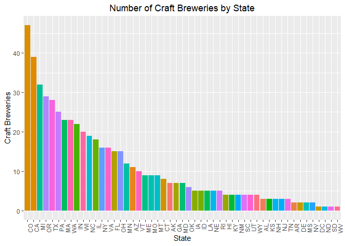
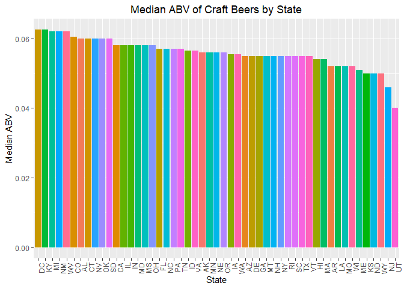
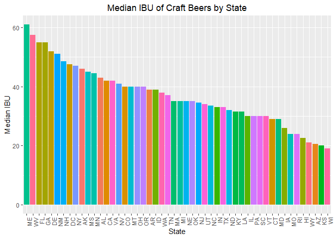

## Introduction

With a strong presence across the 50 states and the District of Columbia, craft breweries are a vibrant and flourishing economic force at the local, state and national level. As consumers continue to demand a wide range of high quality, full-flavored beers, small and independent craft brewers are meeting this growing demand with innovative offerings, creating high levels of economic value in the process.

**Bart Watson**, Chief Economist for the Brewers Association

https://www.brewersassociation.org/statistics/economic-impact-data/

We have been hired to gain incite into breweries in the United Stated. We will focus on providing information to a national brewery for them to look into investing in the craft brewery industry.

## Data

The data for this study will consist of two databases collected and supplied by our client.

**Data/Beers.csv**

| Variable | Description |
| -------- | ----------- |
| Name | name of beer |
| BeerID | unique id number of the beer |
| ABV | alcohol by volume of beer |
| IBU | international bitterness units of the beer |
| Style | style of beer |
| Ounces | unit of measurement for the beer by oz |

**Data/Breweries.csv**

| Variable | Description |
| -------- | ----------- |
| Name | name of beer |
| Brew_ID | unique identification number of the brewery |
| Name | name of brewery |
| City | city where brewery is located |
| State | state where brewery is located |

## Folder Information

There are 3 folders in the BeersAndBreweries repository:

   1. Data - This folder contains the two databases provided by our client. (Beers.csv, Breweries.csv)
   2. Directives - This folder contains the original request for information. (Case Study 01.docx, CaseStudy1Rubric.docx)
   3. The CaseStudy01 folder simply contains the graphics used in this report.


## Questions our client would like addressed

### 1. How many breweries are present in each state?
   
The table below lists breweries in each state. Washington DC, North Dakota, South Dakota and West Virginia are at the bottom with only one brewery. Colorado leads the list with 47.

<!-- -->

### 2. We have two datasets, one with beers and the other with breweries. Below are the first and last 6 observations to give an example of the kind of data used for the analysis.

<table class="table" style="width: auto !important; margin-left: auto; margin-right: auto;">
 <thead>
  <tr>
   <th style="text-align:left;"> Beer_Name </th>
   <th style="text-align:left;"> Style </th>
   <th style="text-align:right;"> ABV </th>
   <th style="text-align:right;"> IBU </th>
   <th style="text-align:left;"> Brewery_Name </th>
   <th style="text-align:left;"> City </th>
   <th style="text-align:left;"> State </th>
  </tr>
 </thead>
<tbody>
  <tr>
   <td style="text-align:left;"> Get Together </td>
   <td style="text-align:left;"> American IPA </td>
   <td style="text-align:right;"> 0.045 </td>
   <td style="text-align:right;"> 50 </td>
   <td style="text-align:left;"> NorthGate Brewing </td>
   <td style="text-align:left;"> Minneapolis </td>
   <td style="text-align:left;"> MN </td>
  </tr>
  <tr>
   <td style="text-align:left;"> Maggie's Leap </td>
   <td style="text-align:left;"> Milk / Sweet Stout </td>
   <td style="text-align:right;"> 0.049 </td>
   <td style="text-align:right;"> 26 </td>
   <td style="text-align:left;"> NorthGate Brewing </td>
   <td style="text-align:left;"> Minneapolis </td>
   <td style="text-align:left;"> MN </td>
  </tr>
  <tr>
   <td style="text-align:left;"> Wall's End </td>
   <td style="text-align:left;"> English Brown Ale </td>
   <td style="text-align:right;"> 0.048 </td>
   <td style="text-align:right;"> 19 </td>
   <td style="text-align:left;"> NorthGate Brewing </td>
   <td style="text-align:left;"> Minneapolis </td>
   <td style="text-align:left;"> MN </td>
  </tr>
  <tr>
   <td style="text-align:left;"> Pumpion </td>
   <td style="text-align:left;"> Pumpkin Ale </td>
   <td style="text-align:right;"> 0.060 </td>
   <td style="text-align:right;"> 38 </td>
   <td style="text-align:left;"> NorthGate Brewing </td>
   <td style="text-align:left;"> Minneapolis </td>
   <td style="text-align:left;"> MN </td>
  </tr>
  <tr>
   <td style="text-align:left;"> Stronghold </td>
   <td style="text-align:left;"> American Porter </td>
   <td style="text-align:right;"> 0.060 </td>
   <td style="text-align:right;"> 25 </td>
   <td style="text-align:left;"> NorthGate Brewing </td>
   <td style="text-align:left;"> Minneapolis </td>
   <td style="text-align:left;"> MN </td>
  </tr>
  <tr>
   <td style="text-align:left;"> Parapet ESB </td>
   <td style="text-align:left;"> Extra Special / Strong Bitter (ESB) </td>
   <td style="text-align:right;"> 0.056 </td>
   <td style="text-align:right;"> 47 </td>
   <td style="text-align:left;"> NorthGate Brewing </td>
   <td style="text-align:left;"> Minneapolis </td>
   <td style="text-align:left;"> MN </td>
  </tr>
</tbody>
</table>

<table class="table" style="width: auto !important; margin-left: auto; margin-right: auto;">
 <thead>
  <tr>
   <th style="text-align:left;"> Beer_Name </th>
   <th style="text-align:left;"> Style </th>
   <th style="text-align:right;"> ABV </th>
   <th style="text-align:right;"> IBU </th>
   <th style="text-align:left;"> Brewery_Name </th>
   <th style="text-align:left;"> City </th>
   <th style="text-align:left;"> State </th>
  </tr>
 </thead>
<tbody>
  <tr>
   <td style="text-align:left;"> Pilsner Ukiah </td>
   <td style="text-align:left;"> German Pilsener </td>
   <td style="text-align:right;"> 0.055 </td>
   <td style="text-align:right;"> NA </td>
   <td style="text-align:left;"> Ukiah Brewing Company </td>
   <td style="text-align:left;"> Ukiah </td>
   <td style="text-align:left;"> CA </td>
  </tr>
  <tr>
   <td style="text-align:left;"> Heinnieweisse Weissebier </td>
   <td style="text-align:left;"> Hefeweizen </td>
   <td style="text-align:right;"> 0.049 </td>
   <td style="text-align:right;"> NA </td>
   <td style="text-align:left;"> Butternuts Beer and Ale </td>
   <td style="text-align:left;"> Garrattsville </td>
   <td style="text-align:left;"> NY </td>
  </tr>
  <tr>
   <td style="text-align:left;"> Snapperhead IPA </td>
   <td style="text-align:left;"> American IPA </td>
   <td style="text-align:right;"> 0.068 </td>
   <td style="text-align:right;"> NA </td>
   <td style="text-align:left;"> Butternuts Beer and Ale </td>
   <td style="text-align:left;"> Garrattsville </td>
   <td style="text-align:left;"> NY </td>
  </tr>
  <tr>
   <td style="text-align:left;"> Moo Thunder Stout </td>
   <td style="text-align:left;"> Milk / Sweet Stout </td>
   <td style="text-align:right;"> 0.049 </td>
   <td style="text-align:right;"> NA </td>
   <td style="text-align:left;"> Butternuts Beer and Ale </td>
   <td style="text-align:left;"> Garrattsville </td>
   <td style="text-align:left;"> NY </td>
  </tr>
  <tr>
   <td style="text-align:left;"> Porkslap Pale Ale </td>
   <td style="text-align:left;"> American Pale Ale (APA) </td>
   <td style="text-align:right;"> 0.043 </td>
   <td style="text-align:right;"> NA </td>
   <td style="text-align:left;"> Butternuts Beer and Ale </td>
   <td style="text-align:left;"> Garrattsville </td>
   <td style="text-align:left;"> NY </td>
  </tr>
  <tr>
   <td style="text-align:left;"> Urban Wilderness Pale Ale </td>
   <td style="text-align:left;"> English Pale Ale </td>
   <td style="text-align:right;"> 0.049 </td>
   <td style="text-align:right;"> NA </td>
   <td style="text-align:left;"> Sleeping Lady Brewing Company </td>
   <td style="text-align:left;"> Anchorage </td>
   <td style="text-align:left;"> AK </td>
  </tr>
</tbody>
</table>

### 3. Report the number of NA's in each column.
   
There are only two columns that have missing data. The ABV looks to be missing 62 entries and IBU has 1005 NA's out of the total 2410 observations. The IBU data may need to be revisited. With close to half the data not reported predictive information based on this information may be skewed. We will address this if this shows to be a problem.
   
<table class="table" style="width: auto !important; margin-left: auto; margin-right: auto;">
 <thead>
  <tr>
   <th style="text-align:left;">   </th>
   <th style="text-align:right;"> # of NAs </th>
  </tr>
 </thead>
<tbody>
  <tr>
   <td style="text-align:left;"> Brewery_id </td>
   <td style="text-align:right;"> 0 </td>
  </tr>
  <tr>
   <td style="text-align:left;"> Beer_Name </td>
   <td style="text-align:right;"> 0 </td>
  </tr>
  <tr>
   <td style="text-align:left;"> Beer_ID </td>
   <td style="text-align:right;"> 0 </td>
  </tr>
  <tr>
   <td style="text-align:left;"> ABV </td>
   <td style="text-align:right;"> 62 </td>
  </tr>
  <tr>
   <td style="text-align:left;"> IBU </td>
   <td style="text-align:right;"> 1005 </td>
  </tr>
  <tr>
   <td style="text-align:left;"> Style </td>
   <td style="text-align:right;"> 0 </td>
  </tr>
  <tr>
   <td style="text-align:left;"> Ounces </td>
   <td style="text-align:right;"> 0 </td>
  </tr>
  <tr>
   <td style="text-align:left;"> Brewery_Name </td>
   <td style="text-align:right;"> 0 </td>
  </tr>
  <tr>
   <td style="text-align:left;"> City </td>
   <td style="text-align:right;"> 0 </td>
  </tr>
  <tr>
   <td style="text-align:left;"> State </td>
   <td style="text-align:right;"> 0 </td>
  </tr>
</tbody>
</table>

### 4. Compute the median alcohol content and international bitterness unit for each state. Plot a bar chart to compare.
   
<!-- --><!-- -->

### 5. Which state has the maximum alcoholic (ABV) beer? Which state has the most bitter (IBU) beer?

Colorado produces the beer with the highest percent of alcohol (ABV). 
      
<table class="table" style="width: auto !important; ">
 <thead>
  <tr>
   <th style="text-align:left;"> State </th>
   <th style="text-align:right;"> ABV </th>
   <th style="text-align:left;"> Beer Name </th>
  </tr>
 </thead>
<tbody>
  <tr>
   <td style="text-align:left;"> CO </td>
   <td style="text-align:right;"> 0.128 </td>
   <td style="text-align:left;"> Lee Hill Series Vol. 5 - Belgian Style Quadrupel Ale </td>
  </tr>
  <tr>
   <td style="text-align:left;"> KY </td>
   <td style="text-align:right;"> 0.125 </td>
   <td style="text-align:left;"> London Balling </td>
  </tr>
  <tr>
   <td style="text-align:left;"> IN </td>
   <td style="text-align:right;"> 0.120 </td>
   <td style="text-align:left;"> Csar </td>
  </tr>
</tbody>
</table>

Oregon has the most bitter beer (IBU).
<table class="table" style="width: auto !important; ">
 <thead>
  <tr>
   <th style="text-align:left;"> State </th>
   <th style="text-align:right;"> IBU </th>
   <th style="text-align:left;"> Beer Name </th>
  </tr>
 </thead>
<tbody>
  <tr>
   <td style="text-align:left;"> OR </td>
   <td style="text-align:right;"> 138 </td>
   <td style="text-align:left;"> Bitter Bitch Imperial IPA </td>
  </tr>
  <tr>
   <td style="text-align:left;"> VA </td>
   <td style="text-align:right;"> 135 </td>
   <td style="text-align:left;"> Troopers Alley IPA </td>
  </tr>
  <tr>
   <td style="text-align:left;"> MA </td>
   <td style="text-align:right;"> 130 </td>
   <td style="text-align:left;"> Dead-Eye DIPA </td>
  </tr>
</tbody>
</table>

### 6. Summary statistics for the ABV variable.

| Description                     | Value   |
| ------------------------------- | ------- |
| Total Values                    | 2348    |
| Null Values                     | 0       |
| Missing Values                  | 62      |
| Minimum Value                   | 0.001   |
| Maximum Value                   | 0.128   |
| Range (Max - Min)               | 0.127   |
| Sum of all Values               | 140.348 |
| Median                          | 0.056   |
| Mean                            | 0.060   |
| Standard Error                  | 0.00028 |
| 95% Confidence Interval of Mean | 0.00055 |
| Variance                        | 0.00018 |
| Standard Deviation              | 0.01354 |
| Variation Coefficient           | 0.22655 |


### 7. Is there an apparent relationship between the bitterness of the beer and its alcoholic content? Draw a scatter plot.
The scatter plot below looks to show a positive correlation between the ABV and IBU.
<!-- -->

Looking at the numbers below we can see a very significant correlation between the alcohol content (ABV) and the bitterness (IBU) of a beer. One thing to keep in mind, there are 62 missing entries in AVB and 1005 in the IBU data leading to a lower degrees of freedom, but at a thousand in the current data set the correlation data is still relevant. This is observational data so even with the correlation, any inferences about causal relationship between alcohol content and bitterness is speculative.


```
## 
## 	Pearson's product-moment correlation
## 
## data:  brew_beer$ABV and brew_beer$IBU
## t = 30, df = 1000, p-value <0.0000000000000002
## alternative hypothesis: true correlation is not equal to 0
## 95 percent confidence interval:
##  0.64 0.70
## sample estimates:
##  cor 
## 0.67
```

### Conclusion

You should stay out of Colorado, California, Michigan, Oregon, and Texas. Also you should try and get more IBU values from the breweries not providing it. [WE SHOULD FACT CHECK IF BEERS ARE MISSING IBU VALUES BY BREWERY]
**sessionInfo**

R version 3.5.1 (2018-07-02)
Platform: x86_64-w64-mingw32/x64 (64-bit)
Running under: Windows >= 8 x64 (build 9200)
